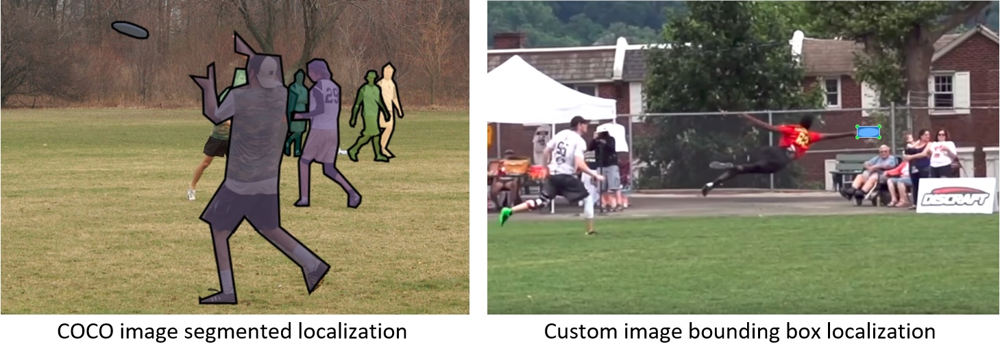

# Custom Object Detection with TensorFlow
This repository describes how to detect, label, and localize objects in videos using TensorFlow's Object Detection API and OpenCV. For my particular application, I want to detect a frisbee in a game of ultimate. The first part of the tutorial shows how to use a pre-trained model, and the second part shows how to train your own model to detect whatever object(s) you would like.


## 1. Installation/Setup
This repo uses the TensorFlow object detection API. Full installation instructions are listed [here](https://github.com/tensorflow/models/blob/master/research/object_detection/g3doc/installation.md). See shorthand version below.

**1.1.** Create a folder in the `C:` drive and name it `tensorflow`

**1.2.** Download [models repository](https://github.com/tensorflow/models)

**1.3.** Download [protobuf compiler](https://github.com/protocolbuffers/protobuf/releases). I’m using Windows, so I used `protoc-3.6.1-win32.zip`

**1.4.** Extract models and protoc to `C:\tensorflow` directory. Rename `models-master` to just `models`

**1.5.** Add `models`, `research` and `slim` directories to your `PYTHONPATH` by running the following command from the command prompt:
```
C:\> set PYTHONPATH=C:\tensorflow\models;C:\tensorflow1\models\research;C:\tensorflow1\models\research\slim
```
**1.6.** Install the other necessary packages by running the following commands in the command prompt:
```
C:\> pip install pillow
C:\> pip install lxml
C:\> pip install Cython
C:\> pip install jupyter
C:\> pip install matplotlib
C:\> pip install pandas
C:\> pip install opencv-python
```

**1.7.** Compile the Protobufs and run setup.py. In the command prompt run, the following commands from `C:\tensorflow\models\research`:
```
protoc object_detection/protos/*.proto --python_out=.
python setup.py build
python setup.py install
```

## 2. Using a pre-trained model
**2.1.** Clone this repository and extract the files to `C:\tensorflow\models\research\object_detection` directory.

**2.2.** This repo uses the `faster_rcnn_inception_v2_coco` model. Download the model [here](http://download.tensorflow.org/models/object_detection/faster_rcnn_inception_v2_coco_2018_01_28.tar.gz). You can also choose to use a different model from TensorFlow's [model zoo](https://github.com/tensorflow/models/blob/master/research/object_detection/g3doc/detection_model_zoo.md) for your object detection application based on whether you prefer speed or accuracy. I prefer accuracy for my application, which is why I chose the faster_rcnn model. After downloading the model, extract the contents of the `faster_rcnn_inception_v2_coco_2018_01_28.tar.gz` file with a file archiver such as WinZip or 7-Zip to the `\object_detection` directory, and then extract the contents of the `faster_rcnn_inception_v2_coco_2018_01_28.tar` file to the `\object_detection` directory. Now, there should be a folder containing a `frozen_inference_graph.pb` file and serveral model checkpoint files. 

**2.3.** Open and run `video_object_detection.py`. This file is a modification of the TensorFlow [object detection tutorial](https://github.com/tensorflow/models/blob/master/research/object_detection/object_detection_tutorial.ipynb) adapted for object detection in a video file, rather than a single image.

**2.4.** This code saves the object detection results to an output video file (`output_video.avi`). You can input your own video by changing the file name in the `video` variable. You can also use your webcam feed by changing the `video` variable to `video = cv2.VideoCapture(0)`.

## 3. Training a model with a custom data set
Although a frisbee is one of the objects already in the COCO data set, I decided to build my own data set of frisbee images to train a custom model on, just to compare the results. The COCO data set contains 2268 images of frisbees localized by segmentation, and I collected 200 images of frisbees and localized them with bounding boxes (see comparisson below). I trained a my custom model by tune-tuning the COCO pre-trained model. Considering the differences between my data and the COCO data, I expected the frisbee detection results to increase marginally.  

**3.1. Collect and label images** 

Create a new folder called `images` in the `\object_detection` directory, and create a `train` and a `test` folder inside the `images` folder. 

Collect at least 100 images of an object and store them in the `images` folder. The more images and the greater the variation in the images (object size, orientation, background, lighting conditions), the more robust the object detector will be. 

After collecting all the images, move ~10% of them to the `test` folder and the remaining ~90% to the `train` folder.

Download and install [labelimg](https://www.dropbox.com/s/tq7zfrcwl44vxan/windows_v1.6.0.zip?dl=1). Its [Github page](https://github.com/tzutalin/labelImg) has very clear instructions on how to install and use it.

Open lebelimg, select "open dir", and select the `\images\train` directory. Select “Create\nRectBox” to draw a bounding box around your object(s) of interest and enter your desired label(s). Save the file to create a .xml file containing the bounding box coordinates and the object label(s). Click “next image” to continue to the next image and repeat the process for all your training images. Repeat the process for all the images in the `\images\test` directory.

**3.2. Generate training data**

In this step, the `.xml` data is converted to `.csv` files which are used to generate the TFRecords that serve as the input data to train our model. I used the `xml_to_csv.py` and `generate_tfrecord.py` scripts from [Dat Tran’s Raccoon Detector dataset](https://github.com/datitran/raccoon_dataset) with some slight modifications to work with our directory structure.

Within the `\object_detection` directory, create a `data` folder and a `training` folder.

From the `\object_detection` directory, run the following command in the command prompt: 
```
python xml_to_csv.py
```
This should create `.csv` files for both the train and test data in the `\data` folder.

Open the `generate_tfrecord.py` file in a text editor and replace the labels in the following block of code with your own labels:
```
def class_text_to_int(row_label):
    if row_label == 'frisbee':
        return 1
    else:
        return 0
 ```
If you are training a classifier to detect more than one object, you will need to add more labels, for example, like this:
```
def class_text_to_int(row_label):
    if row_label == 'eggs':
        return 1
    elif row_label == 'bacon':
        return 2
    elif row_label == 'toast':
        return 3
    else:
        return 0
```

Generate the TFRecord files by running these commands from the `\object_detection` directory:
```
python generate_tfrecord.py --csv_input=data\train_labels.csv --image_dir=images\train --output_path=data\train.record
python generate_tfrecord.py --csv_input=data\test_labels.csv --image_dir=images\test --output_path=data\test.record
```

**3.3. Create label map**

The label map defines a mapping of class names to class ID numbers. Use a text editor to create a new file and save it as `custom_label_map.pbtxt` in the `\training` directory. Below is my label map:
```
item {
  id: 1
  name: 'frisbee'
}
```
Using the labels and matching ids from the example in step 3.2, the label map would look like this:
```
item {
id: 1
name: 'eggs'
}

item {
id: 2
name: 'bacon'
}

item {
id: 3
name: 'toast'
}
```

**3.4. Configure training**

Navigate to `C:\tensorflow\models\research\object_detection\samples\configs` and copy the `faster_rcnn_inception_v2_coco.config` file into the `\training` directory.

Make the following changes to the `.config` file:
* Line 10: Change `num_classes` to the number of different objects you want to detect.
* Line 107: To fine-tune a pre-trained model, change `fine_tune_checkpoint` to: `C:/tensorflow/models/research/object_detection/faster_rcnn_inception_v2_coco_2018_01_28/model.ckpt`
* To train a model from scratch (not recommended), change line 108 to:
`from_detection_checkpoint: false`
* Lines 122 and 124: In the `train_input_reader` section, change `input_path` and `label_map_path` to: 
    - input_path : `C:/tensorflow/models/research/object_detection/data/train.record`
    - label_map_path: `C:/tensorflow/models/research/object_detection/training/custom_label_map.pbtxt`
* Line 128: Change `num_examples` to the number of images you have in the `\images\test` directory.
* Lines 136 and 138. In the `eval_input_reader` section, change `input_path` and `label_map_path` to:
    - input_path : `C:/tensorflow/models/research/object_detection/data/test.record`
    - label_map_path: `C:/tensorflow/models/research/object_detection/training/custom_label_map.pbtxt`

Save the file after the changes have been made.

**3.5. Train the model on custom data set**

Move `train.py` from `\object_detection\legacy` directly into the `\object_detection` folder. 

From the `\object_detection` directory, run the following command to begin training:
```
python train.py --logtostderr --train_dir=training/ --pipeline_config_path=training/faster_rcnn_inception_v2_coco.config
```

You can view the progress of the training job by using TensorBoard. Open a new instance of the command prompt, change to the `\object_detection` directory, and issue the following command:
```
tensorboard --logdir=training
```
This creates a webpage on your local machine at YourPCName:6006, which can be viewed through a web browser. TensorBoard displays various information and plots about the progress of the training job. The most important plot is the TotalLoss plot, which shows the overall loss of the model as a function of the number of training steps. 

<p align="center">
  
</p>

Once the loss begins to level out, the training can be terminated by pressing Crtl+C in the command prompt window where the training was initialized. The training can be initialized again later, and it will restart from the last saved checkpoint. The latest checkpoint will be used to create the frozen inference graph.

**3.6. Export inference graph**

From the `\objet_detection` directory, run the following command, replacing `model.ckpt-XXXX` with the latest `.ckpt` file in the training folder:
```
python export_inference_graph.py --input_type image_tensor --pipeline_config_path training/faster_rcnn_inception_v2_coco.config --trained_checkpoint_prefix training/model.ckpt-XXXX --output_directory inference_graph
```
This creates a frozen_inference_graph.pb file in the `\inference_graph` folder.

**3.7. Use your custom object detector**

To use your custom-trained object detector, open `video_object_detection.py` and change the `MODEL_NAME` variable from `faster_rcnn_inception_v2_coco_2018_01_28` to `inference_graph`. Change the `PATH_TO_LABELS` variable from `os.path.join(CWD_PATH,'data','mscoco_label_map.pbtxt')` to `os.path.join(CWD_PATH,'training','custom_label_map.pbtxt')`. Change the `NUM_CLASSES` variable from 90 to the number of object classes you are trying to detect. 

Its difficult to tell, but my resulting custom fine-tuned model produces slightly better detection accuracy of a frisbee than the pre-trained model. 

